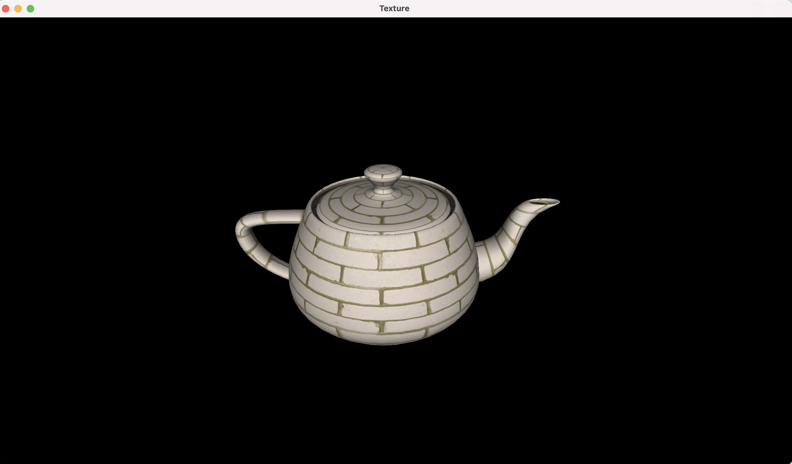
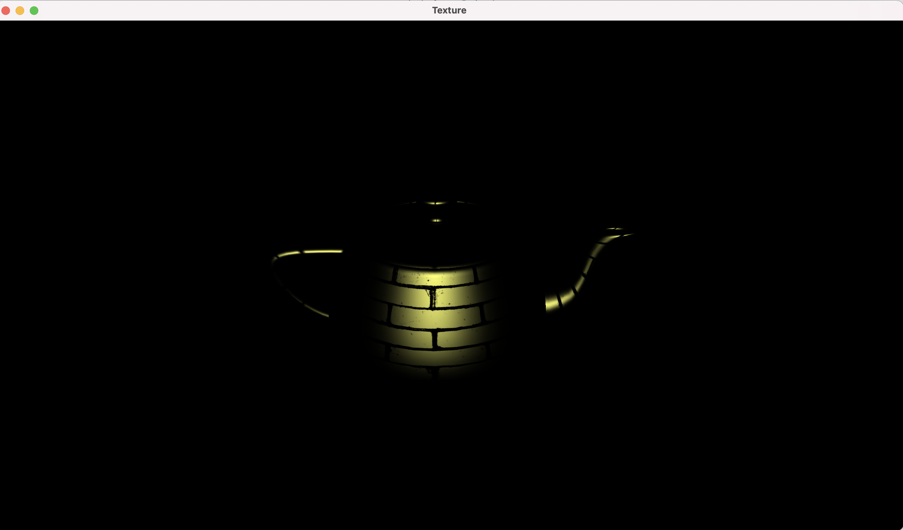
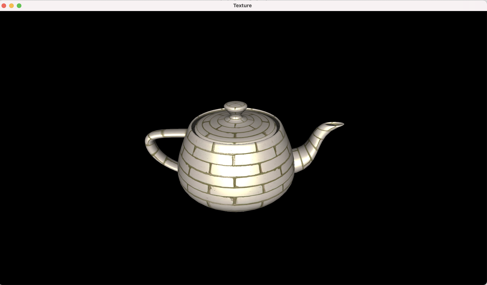
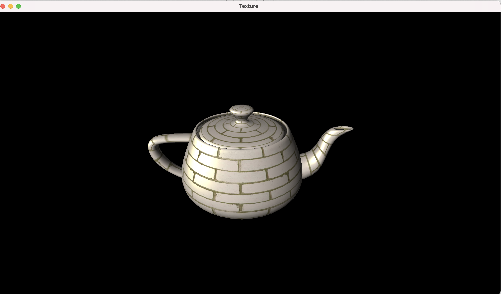

Project 4

Rendering of the teapot using diffuse texture for diffuse and ambient shading

Rendering of the teapot using specular texture for specular shading

Rendering of the teapot using specular + ambient textures

Rotation of the light source

In addition to the previous project

1. The teapot texture coordinates were stored in a vector using the texture faces of the object mesh
2. The diffuse and specular texture data was loaded from the png files using the lodepng decode function
3. The diffuse texture data was sent to the GPU and the texture parameters like min/mag filter and wrap were specified.
4. This was done for the specular texture as well
5. The textures were bound to a Texture unit and a sampler was set as a uniform variable for each texture. The texture units were set to active.
6. The vertex shader passed the texture coordinates for each vertex to the fragment shader.
7. The fragment shader used the texture coordinates and the sampler to sample the texture at the interpolated texture coordinates

https://user-images.githubusercontent.com/16291248/212488617-04a9e98b-2a54-4cb9-a907-bf80d757d50f.mp4

How to use your implementation

1. Compile the texture.cpp file, cyCodeBase must be present in the include path

clang++ -std=c++11 -stdlib=libc++ texture.cpp lodepng.cpp -o texture -lglfw -lglew -framework OpenGL -I/Users/u1316087/Downloads/homebrew/include/ -L/Users/u1316087/Downloads/homebrew/lib/de/ -L/Users/u1316087/Downloads/home

1. Run the executable

./texture teapot.obj

1. Controls

The mouse left button with CNTRL enables rotating the light source in world space.

What operating system and compiler you used
 Operating System: macOS 11.3 Big Sur

GLFW version: 3.3.6

GLEW version: 2.2.0\_1

Compiler:
 Apple clang version 12.0.5 (clang-1205.0.22.11) Target: x86\_64-apple-darwin20.4.0

External libraries and additional requirements to compile the project.

cyCodeBase, GLFW and GLEW are required
